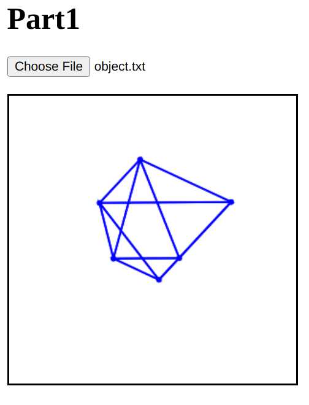
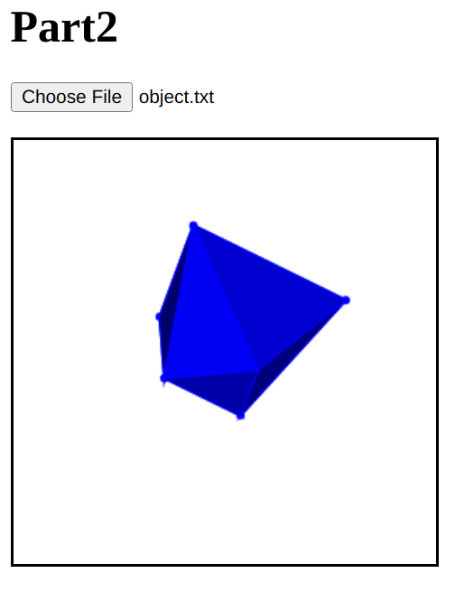

# 3D Viewer

This program was implemented by React.

## Part 1

Display a 3D object in a 2D graph and rotate the object with a mouse.

<p align="center"> 

</p>

To run the program,
```
cd part1
npm install
npm start
```

The rotation of an object in 3D space can indeed be divided into two parts, where the horizontal movement of the mouse controls rotation about the Y-axis, and the vertical movement of the mouse controls rotation about the X-axis. To calculate the new positions of points on the object after rotation, rotation matrices are used.

1. Horizontal Movement (Rotate about Y-Axis):

   ```math
   $$\begin{bmatrix}
    cos\theta & 0 & sin\theta\\\
    0 & 1 & 0\\\
    -sin\theta & 0 & cos\theta
    \end{bmatrix}$$
   ```

    Here, 𝜃 represents the angle of rotation about the Y-axis. When the mouse moves to the right, 𝜃 is positive. Conversely, when the mouse moves to the left, 𝜃 is negative.

3. Vertical Movement (Rotate about X-Axis):
   
   ```math
   $$\begin{bmatrix}
    1 & 0 & 0\\\
    0 & cos\theta & -sin\theta\\\
    0 & sin\theta & cos\theta
    \end{bmatrix}$$
   ```
    In this case, 𝜃 represents the angle of rotation about the X-axis. When the mouse moves downward, 𝜃 is positive. Conversely, when the mouse moves upward, 𝜃 is negative.

## Part 2

Make each of the visible faces of the object a solid, opaque blue color. The color would change based on the angle with the Z-axis.

<p align="center"> 

</p>

To run the program,
```
cd part2
npm install
npm start
```

1. Calculating Normal Vectors: 
   Initially, the normal vectors for each face were computed using the cross product. It's important to note that these normal vectors were then converted into unit vectors to ensure consistency in their length.

2. Determining the Angle with Z-Axis: 
   To determine how each face was oriented with respect to the Z-axis, the dot product between the normal vector of the face and the Z-axis vector (0, 0, 1) was computed. This dot product value was then converted to its absolute value to ensure it falls within the range of 0 to 1.

3. Assigning Face Colors Based on Dot Product: 
   Depending on the result of the dot product, specific colors were assigned to the faces. When the dot product equaled 1, it indicated that the normal vector of the face was parallel to the Z-axis, resulting in a face color of (0, 0, 255). Conversely, when the dot product equaled 0, it meant that the normal vector of the face was perpendicular to the Z-axis, leading to a face color of (0, 0, 95). An interpolation technique was used to map the dot product values from the range [0, 1] to the color range [95, 255].

4. Sorting Faces for Rendering: 
   To ensure that only the front surface of the object was visible to the observer, a sorting mechanism was implemented. The faces were sorted based on the average Z-coordinate of their three vertices. Faces with a higher average Z-coordinate were drawn later, ensuring they were not obscured by other faces.
